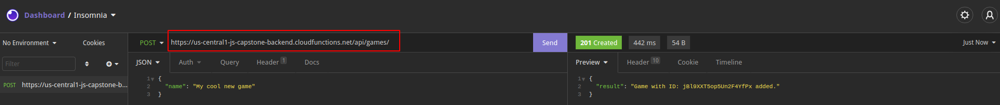
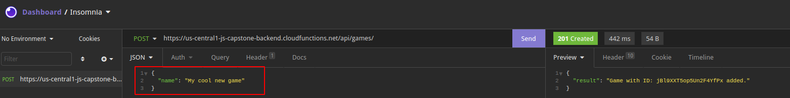
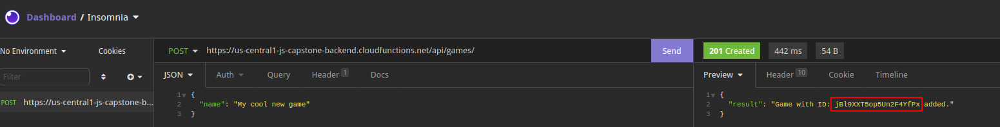

# Leaderboard

In this project I'm building a small web-app using webpack to set it up and ES6 syntax to build it effectively.

## Learning objetives

- ES6 syntax
- Webpack usage
- Implementation of drag and drop features
- Place objects dynamically in the DOM with the drag and drop feature
- Use JS modules to write more readable code

## Built with

- HTML/CSS
- Javascript
- Webpacker

## Set up

> To get a local copy up and running follow these simple example steps.

<summary>Get instructions</summary>

```
$ cd <folder>
```

~~~bash
$ git clone https://github.com/alvp01/leader-board-project.git
$ cd leader-board-project
$ yarn install
$ npm run start
~~~

>yarn install will install the project dependencies
>npm run start will start the project local server to deploy the web app

## Live link

[Live demo](https://alvp01.github.io/leader-board-project/)

## Creating the game id

To create the game id I used Insomnia API client<br>
Following these steps:
<br><br>

Used the following url for the request: https://us-central1-js-capstone-backend.cloudfunctions.net/api/games/
<br><br>

Sent a name as parameter
<br><br>

Received the game ID to use it in the following url: 'https://us-central1-js-capstone-backend.cloudfunctions.net/api/games/:id/scores/'

## Author

👤 **Abel**
- Github: [@alvp01](https://github.com/alvp01)
- Twitter: [@alvp01](https://twitter.com/alvp01)
- Linkedin: [Abel Lavieri](https://www.linkedin.com/in/alvp01/)

## 🤝 Contributing

Contributions, issues and feature requests are welcome!

Feel free to check the [issues page](https://github.com/alvp01/leader-board-project/issues)

## Acknowledgments

- [Microverse](https://www.microverse.org/)
- [Leaderboard API](https://www.notion.so/Leaderboard-API-service-24c0c3c116974ac49488d4eb0267ade3)
- [insomnia](https://insomnia.rest/)
- [Fontawesome](https://fontawesome.com/)
- [Google fonts](https://fonts.google.com/)

## 📝 License

This project is [MIT](./MIT.md) licensed.